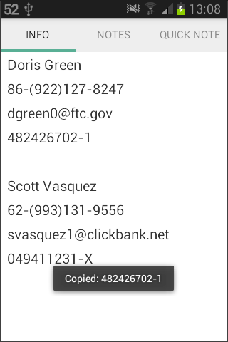
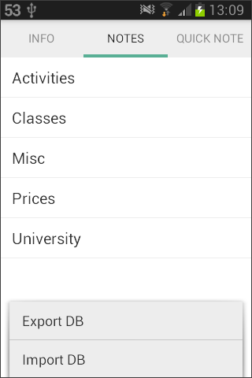
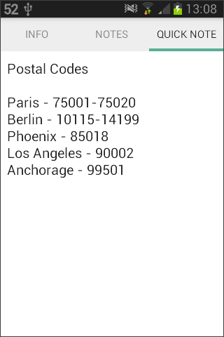

# QuickInfo

Provides quick access to frequently used information.

## Notes

- DB is exported to "sdcard/QuickInfo" folder with "info.db" name
- the exported DB can be viewed and edited with any SQLite editor (like [SQLite Viewer](https://play.google.com/store/apps/details?id=com.kokufu.android.apps.sqliteviewer.free) app)

## Download

- [**releases**](https://github.com/mortalis13/QuickInfo-Android/releases)

## Changelog

### 1.0.3

- exception handling

### 1.0.2

- redesigned interface to tab navigation
- A-Z sorting of notes
- scrolling Quick Note

### 1.0.1

- added toast message on export DB
- removed toast message on copy Personal Info elements
- removed Setting menu

## Screenshots

  
  
 
